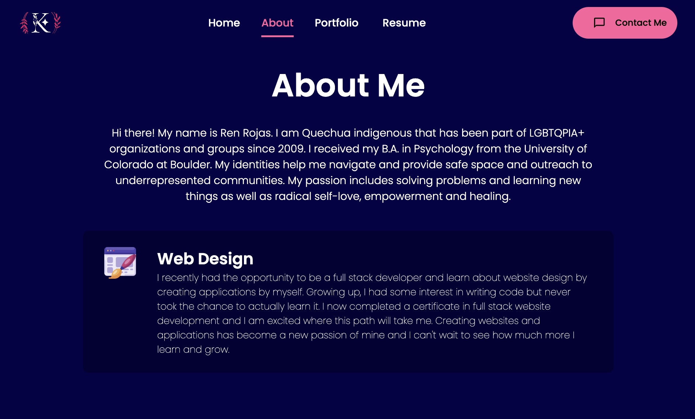
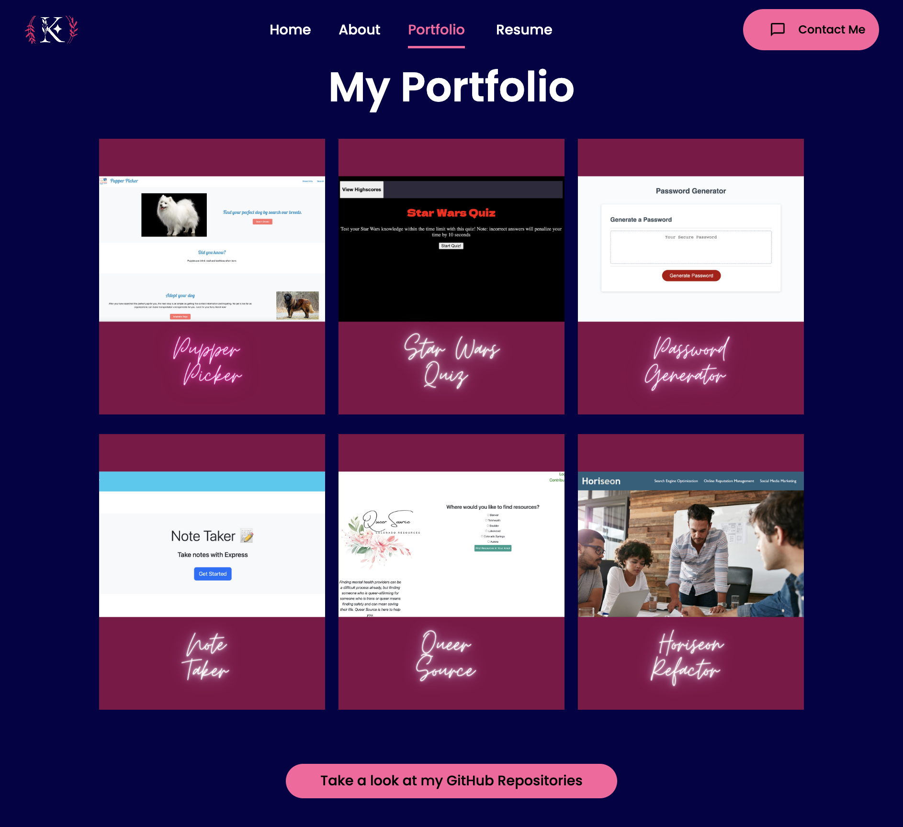
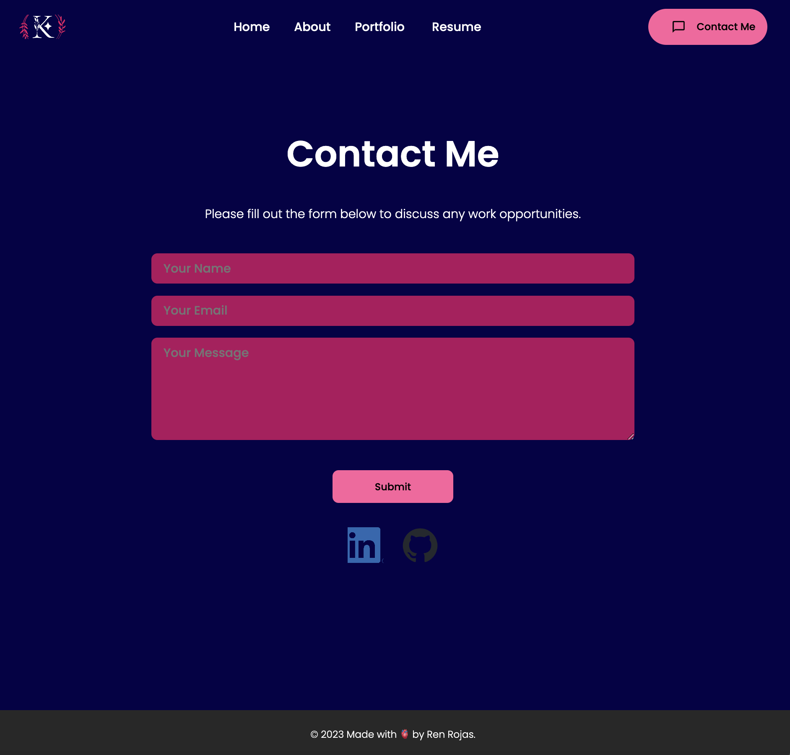

# Ren Rojas Portfolio

## Description
This project was created with ReactJS and is designed to provide potential employers information about me, examples of work, a contact form and my dowloadable resume.

My project's motivation was to have create a single-page application where I can showcase my professional qualities and contact information all in a single place where future employers can easily access.  

## Installation
GitHub Repository: https://github.com/renrojas/Ren-Portfolio-React
Heroku: https://cryptic-ridge-66267-e6479b916eed.herokuapp.com

## Usage
Welcome to my React Portfolio. From the intro page, you have the options to navigate through the nav bar (read about me, see my portfolio, download my resume)  and contact me.

On the About Me section, you will learn a little about me and the type of work I do. 

In the Portfolio section, you can check out some projects I have done by clicking on a project and seeing the live webpages. To see the repositories you can click on "Take a look at my GitHub Repositories"

In the Contact section, you will be able to access a form which you can use to contact me directly which will send me an email with your message. You will also be able to see icons for my LinkedIn and my GitHub.

## Credits

https://www.geeksforgeeks.org/how-to-download-pdf-file-in-reactjs/ - Download PDF in React

https://www.youtube.com/watch?v=4ag1LsgIUc0 - Creating a portfolio in React

https://code.visualstudio.com/docs/nodejs/reactjs-tutorial - ReactJS

https://www.emailjs.com/docs/examples/reactjs/ - EmailJS 

https://github.com/coding-boot-camp -  University of Denver’s GitLab course material (DU-VIRT-FSF-PT-04-2023-U-LOLC)

https://coding-boot-camp.github.io/full-stack/heroku/heroku-deployment-guide - Heroku Deployment Guide

https://www.w3schools.com/react/default.asp - React - W3 schools

## License
MIT License

Copyright (c) 2023 renrojas

Permission is hereby granted, free of charge, to any person obtaining a copy
of this software and associated documentation files (the "Software"), to deal
in the Software without restriction, including without limitation the rights
to use, copy, modify, merge, publish, distribute, sublicense, and/or sell
copies of the Software, and to permit persons to whom the Software is
furnished to do so, subject to the following conditions:

The above copyright notice and this permission notice shall be included in all
copies or substantial portions of the Software.

THE SOFTWARE IS PROVIDED "AS IS", WITHOUT WARRANTY OF ANY KIND, EXPRESS OR
IMPLIED, INCLUDING BUT NOT LIMITED TO THE WARRANTIES OF MERCHANTABILITY,
FITNESS FOR A PARTICULAR PURPOSE AND NONINFRINGEMENT. IN NO EVENT SHALL THE
AUTHORS OR COPYRIGHT HOLDERS BE LIABLE FOR ANY CLAIM, DAMAGES OR OTHER
LIABILITY, WHETHER IN AN ACTION OF CONTRACT, TORT OR OTHERWISE, ARISING FROM,
OUT OF OR IN CONNECTION WITH THE SOFTWARE OR THE USE OR OTHER DEALINGS IN THE
SOFTWARE.
